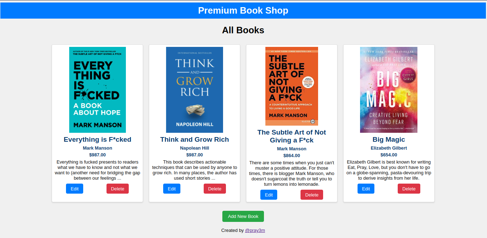
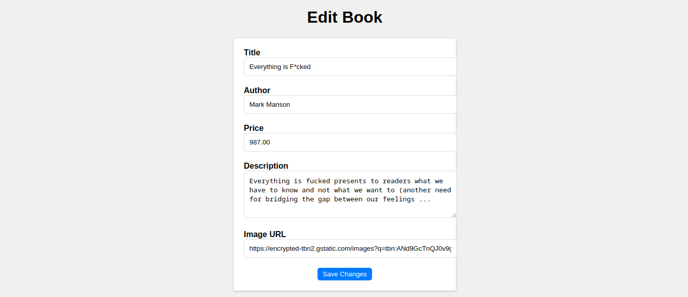

# Bookstore CRUD App

#### Digital Pathshala Assignment | Node JS September Session

Guided by: [Mahesh Basnet](@https://github.com/maheshbasnet089)

This is a simple CRUD (Create, Read, Update, Delete) application for managing books in a bookstore. It's built with Node.js, Express.js, EJS templates, and Sequelize ORM.

## Features

- Create, Read, Update, and Delete books.
- List all books in the bookstore.
- Minimalistic and easy-to-use interface.

## Installation

1. Clone this repository
2. Run `npm install`
3. Run `npm start`
4. Visit http://localhost:3000

## Screenshots

### All Books Page

### Edit Book Page

